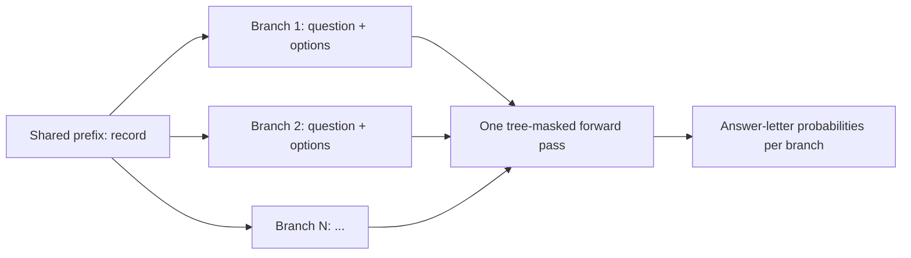

# bonsai-4b-system-one

A lightweight **System One model for edge devices**, built on [Ternary-Bonsai-4B](https://huggingface.co/prism-ml/Ternary-Bonsai-4B-unpacked). In the style of Jev, it answers many choice, rating, and yes/no questions about one record **in a single forward pass**, returning a probability per option instead of generating text.

The model itself is unchanged: it stays frozen, with no adapter and no fine-tuning. The System One behavior comes from the inference code: every question becomes a branch after the shared record, and a **tree attention mask** lets each branch see the record and its own tokens but never another branch. The record is encoded once, and each answer is read from the native LM head.

On Apple Silicon it runs from the 2-bit packed weights (about 1.1 GB) with MLX; a PyTorch backend uses the FP16 weights. A version with a LoRA adapter trained for this request format is planned separately.

> Experimental research artifact. English-oriented; not for high-stakes decisions. Not affiliated with PrismML, Qwen/Alibaba Cloud, or TypeSafe.

## Accuracy

Zero-shot accuracy on public datasets that were not used to design the prompt or readout (500 rows each, sampled with a fixed seed; protocol in [docs/BENCHMARKS.md](docs/BENCHMARKS.md)):

| Dataset | Task | Type | Accuracy | 95% CI |
| --- | --- | --- | ---: | :---: |
| AG News | news topic | choice, 4 options | **0.868** | 0.838–0.896 |
| MASSIVE (en-US) | voice-assistant scenario | choice, 18 options | **0.562** | 0.518–0.604 |
| MNLI (matched) | entailment / neutral / contradiction | choice, 3 options | **0.824** | 0.790–0.856 |
| BoolQ | yes/no question about a passage | noul | **0.836** | 0.802–0.868 |
| SST-5 | 5-level sentiment | score, 5 levels | **0.402** | 0.360–0.444 |

SST-5 mean absolute error: 0.77 levels. One canonical option order, single forward pass per request, MLX on an Apple M2. Row-level predictions: [`results/accuracy/`](results/accuracy/).

Score-type questions (ratings) are the weakest point. See [Limitations](#limitations).

## Speed

Apple M2 (24 GB), public fixture (16 records × 3 repeats), median request latency, model loading excluded:

| Questions per record | 1 | 2 | 4 | 8 | 16 |
| --- | ---: | ---: | ---: | ---: | ---: |
| MLX, one tree-masked pass | 0.53 s | 0.69 s | 0.98 s | 1.77 s | 3.43 s |
| MLX, one pass per question | 0.53 s | 1.05 s | 2.00 s | 4.18 s | 8.66 s |
| Speedup, MLX | 1.00× | 1.51× | 2.03× | 2.37× | **2.52×** |
| Speedup, PyTorch MPS | 0.97× | 1.60× | 2.12× | 2.46× | **2.63×** |

On the Mac, time grows with token count, so the gain comes from encoding the record once (581 instead of 1,324 tokens at N = 16). CUDA latency has not been measured. Details in [docs/RESULTS.md](docs/RESULTS.md) and [`results/latency/`](results/latency/).

## How it works



- Each question is rendered as a chat prompt. The prompts' common token prefix (the record) is stored once; each question's suffix becomes a branch.
- A causal **tree attention mask** lets a branch attend to the shared prefix and its own tokens, never to another branch. Position IDs restart after the prefix for every branch.
- The native LM head reads the answer-letter logits (`A`, `B`, …) at the end of each branch. Nothing is generated.

The model weights are not modified; everything above is in this code. See [docs/METHOD.md](docs/METHOD.md).

## Install

PyTorch and MLX pin different `transformers` versions; use separate environments.

```bash
git clone https://github.com/senna-lang/bonsai-4b-system-one && cd bonsai-4b-system-one
python -m venv .venv && . .venv/bin/activate

pip install -e '.[mlx]'     # Apple Silicon: 2-bit packed weights, ~1.1 GB
# or
pip install -e '.[torch]'   # CUDA, Apple MPS, or CPU: FP16 weights, ~8 GB
```

## Run the examples

```bash
python examples/run_example.py --backend mlx   # or --backend torch
```

The script downloads the pinned Bonsai weights from the Hugging Face Hub on first use, then scores the fictional requests in [`examples/requests.jsonl`](examples/requests.jsonl).

## Python API

```python
from system_one_bonsai import Branch, PackedRequest
from system_one_bonsai.inference_mlx import load_model, predict_request   # or system_one_bonsai.inference

model, tokenizer = load_model()
request = PackedRequest(
    state="A customer received a replacement device after the first one stopped charging.",
    branches=[
        Branch("choice", "Which issue is described?", ["Delivery delay", "Charging failure", "Billing error"]),
        Branch("noul", "Does the record mention a replacement?"),
    ],
)
probabilities = predict_request(model, tokenizer, request)
# probabilities[0]: [P(Delivery delay), P(Charging failure), P(Billing error)]
# probabilities[1]: [P(No), P(Yes)]
```

| Branch kind | `options` | Output |
| --- | --- | --- |
| `choice` | 2–20 options | one probability per option |
| `score` | 2–20 ordered rating levels | one probability per level; compute `sum(level * p)` with your own level values for an expected score |
| `noul` | empty (fixed `[No, Yes]`) | `[P(No), P(Yes)]` |

Probabilities are **conditional on the listed options** and are not guaranteed to be calibrated. This code uses one canonical option order; it does not average over option orders.

## Local server (System One API format)

Loading the model takes a few seconds, so for repeated use keep it resident behind a local HTTP endpoint:

```bash
python -m system_one_bonsai.serve            # MLX on 127.0.0.1:8765; --backend torch, --host, --port
```

`POST /v1/systemone` accepts and returns the request and answer shapes that System One API clients use, so a client of that API can point its base URL here:

```bash
curl -s localhost:8765/v1/systemone -d '{
  "state": {"ticket": "I was charged twice for my order and want my money back."},
  "questions": {
    "team":    {"type": "choice", "instructions": "Which team should handle this?", "criteria": {"billing": "Payments and refunds", "shipping": "Delivery", "tech": "Product issues"}},
    "urgency": {"type": "score",  "instructions": "How urgent is this?", "criteria": ["low", "medium", "high"]},
    "refund":  {"type": "noul",   "instructions": "Does the customer ask for a refund?"}
  }}'
# {"answers": {"team": {"type": "choice", "choice": "billing", "probabilities": {...}, "confidence": ...},
#              "urgency": {"type": "score", "score": <expected level index>, "confidence": ...},
#              "refund": {"type": "noul", "noul": <P(yes)>}}, "usage": {"input_tokens": ..., "output_tokens": 0}}
```

How a request maps onto this model: `state` is rendered as indented JSON and becomes the record; each choice option reads `label: description`; score levels are the criteria, lowest first; a yes/no question (`noul`, or `bool`) gets its true/false criteria appended to the instructions. `confidence` is the highest option probability. The format was derived from a client implementation, not from a published specification, so compatibility is not guaranteed. The server has **no authentication**, ignores API keys, binds to localhost by default, and answers one request at a time; do not expose it to a network.

For example, the [pi](https://github.com/earendil-works/pi) coding agent sends its Jev classifier calls here with this entry in `~/.pi/agent/models.json` (verified with pi's `classify()`):

```json
{ "providers": { "typesafe": { "baseUrl": "http://127.0.0.1:8765/v1", "apiKey": "local" } } }
```

## omp plugin

[`omp/`](omp/) is a plugin for the [omp](https://github.com/can1357/oh-my-pi) coding agent. It registers the local server as the judgment model `bonsai-local/bonsai-4b-system-one`, so omp's `judge` role, which drives the per-prompt `auto` thinking level and other typed judgments, runs on this model offline and at no cost. An optional `router` feature also switches the session's model once, from the first prompt's rated difficulty, to your `@smol`, `@mid` (or `@default`), or `@slow` role; the plugin assigns no models itself.

```bash
omp plugin marketplace add senna-lang/bonsai-4b-system-one
omp plugin install system-one-bonsai@bonsai-4b-system-one
omp plugin features system-one-bonsai --enable router     # optional
```

Then select the model for the role in `~/.omp/agent/config.yml`:

```yaml
modelRoles:
  judge: bonsai-local/bonsai-4b-system-one
defaultThinkingLevel: auto
```

The plugin does not install Python or the model. Install this repository (see [Install](#install)) and either keep `python -m system_one_bonsai.serve` running, or let the plugin start it on the first prompt by pointing it at your environment:

```bash
export BONSAI_SYSTEM_ONE_SERVE_CMD="/path/to/bonsai-4b-system-one/.venv/bin/python -m system_one_bonsai.serve"
```

The started server keeps running after omp exits (about 1.5 GB resident on MLX; log in `~/.cache/bonsai-system-one/serve.log`). If the server is unavailable, the turn continues: auto thinking keeps its previous level and the router keeps the current model.

On 80 coding-agent requests with reference effort levels from a strong model (Claude Opus; not human labels), asked omp's own auto-thinking question through omp's judge path, this model matched the reference effort on 66% of requests (98.8% within one level, median 0.8 s on an Apple M2), against 29% for omp's built-in local `lfm2-1.2b` judge and 25% for `lfm2.5-230m`. It tends to rate one level low, mostly `high` for `xhigh` requests.

## Tests

```bash
pip install -e '.[test]' && pytest
```

The tests use a stand-in tokenizer and need no model weights. They check request validation, prefix sharing, branch spans, position IDs, and the local server's request translation and answer shapes.

## Verification

[`fixtures/behavior.jsonl`](fixtures/behavior.jsonl) is a small fictional fixture (16 records, 42 branches) for checking behavior with the real model:

- `scripts/check_branch_isolation.py` — a branch's probabilities do not change when other branches are added, reordered, or removed (max diff 0.0034 MLX, 0.0039 MPS).
- `scripts/compare_backends.py` — PyTorch (MPS) and MLX agree (42/42 argmax, max diff 0.0035).
- `scripts/bench_latency.py` — request latency of tree-masked packing vs one forward per question.
- `scripts/bench_accuracy.py` — the public accuracy benchmark above.

See [docs/RESULTS.md](docs/RESULTS.md) for commands and numbers.

## Limitations

The numbers below were measured in the development project on data that is **not distributed** (500 held-out branches, compared with the soft answer distributions of a DeepSeek Flash teacher, not human labels, option orders averaged, MLX). They are reported for context and cannot be re-run from this repository.

| Branch kind | n | This model (no adapter) | Bonsai + LoRA trained for this format |
| --- | ---: | ---: | ---: |
| choice | 163 | 0.908 | 0.890 |
| noul | 136 | 0.853 | 0.890 |
| score | 201 | **0.701** | 0.771 |
| all | 500 | 0.810 | 0.842 |

Teacher top-1 agreement. Without an adapter, choice questions are as good as with one; score questions lose 7 points (paired 95% CI 1.5–12.9 points), and noul probabilities are less calibrated (ECE 0.091 vs 0.030). Use this model mainly for choice and yes/no questions; treat score probabilities with care.

## License

Apache-2.0 (see [`LICENSE`](LICENSE)). The Bonsai model is obtained separately under its own license (Apache-2.0). See [`THIRD_PARTY.md`](THIRD_PARTY.md).
